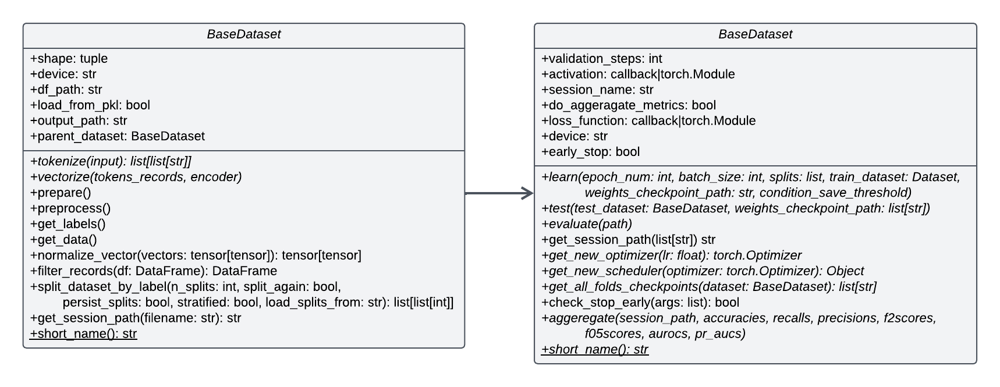
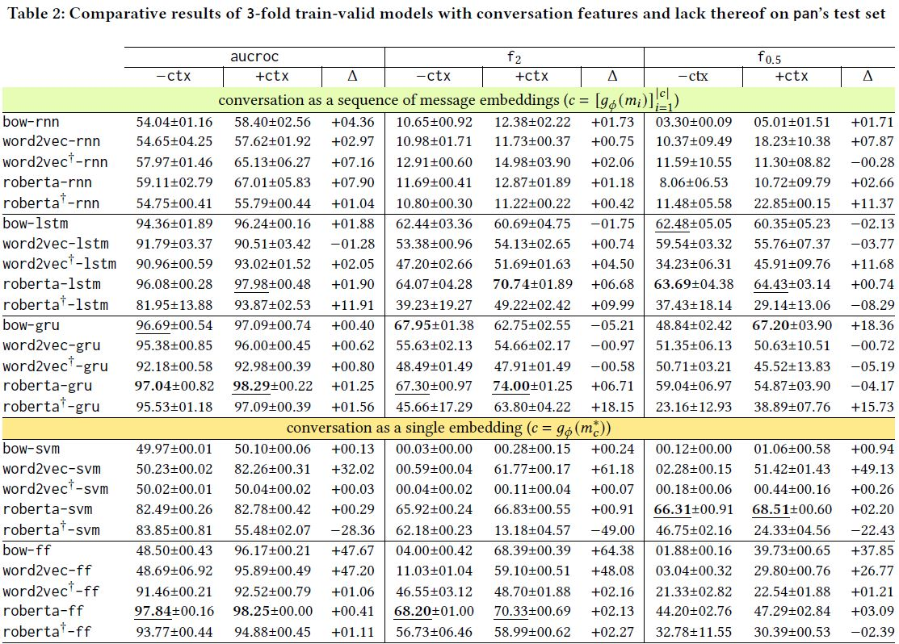
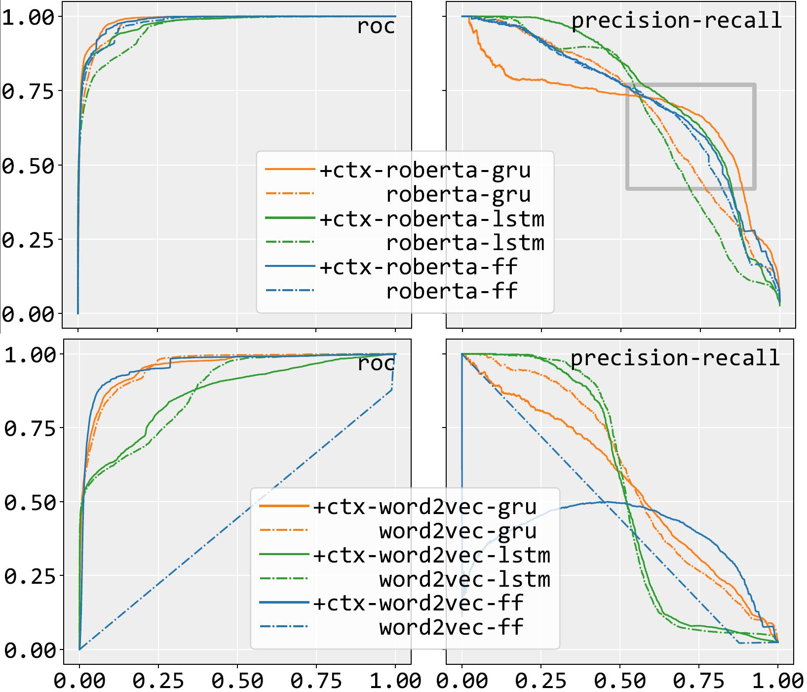

# Osprey 🪶
With the prevalence of more technology, children access it way before they are of legal age and with little cognitive development. An alarming problem in this regard is children engaging with predators in online grooming conversations. Besides deep web that used to be a hub forillegal activities including child pornography, main stream digital platforms such as online videogames and chat rooms are currently the more common places where children are present and are easy prey for online sexual predators such as those who are diagnosed with paedophilia; an act of an adult having sexual involvement with a minor, through grooming where the sexual predator tries to form emotion relationship with a minor in order to get her trust and make her engage in sexual activities afterwards. 

Around 60%-80% of female high school students have to face online sexual grooming incidents in their life. In many of these instances, the predators try to mix explicit remarks in the conversation to get a sense of how they are going to proceed with the victim, which can be extracted by ``natural language processing`` (NLP) techniques and employed by ``machine learning`` methods to catch such predators. 

Table of content:
1. [Setup](#1-setup)
2. [Quickstart](#2-quickstart)
3. [Code Structure](#3-code-structure)
4. [Results](#4-results)
5. [Notes](#5-notes)

## 1. Setup
You can setup the code in different ways. You can use package managers such as Mamba and Conda to install the packages. If you prefer using docker, clone this project and build the Dockerfile.
First we need the project source code.
```sh
git clone https://github.com/fani-lab/Osprey.git
cd Osprey
```
### 1.1 Using mamba/micromamba/conda
These package managers basically have similar interfaces. You can install which ever you think is appropriate for your environment and system. We prefer using mamba as it is faster than conda and has more features than micromamba.

```sh
mamba create -n osprey-cuda
mamba activate osprey-cuda
mamba env update -n osprey-cuda --file environment.yml
python -m nltk.downloader punkt stopwords
```

### 1.2 Using Docker
In case you need an image of this project to run it on a cloud server, you can simply clone the project and run:
```sh
docker build -t osprey-cuda-image .
```
Please pay attention to `.dockerignore` file. The docker engine currently ignores `data`, `logs`, and `output` directories. If you do not have the datasets, please add them to respective project directory and when ran the container, mount the directories to the container.
## 2. Quickstart
You can use the commandline interface (cli) built in this project to run different scripts or train your models. You can use
```sh
python runner.py command
```
and replace `command` with the desired value. You can also run the following command for more help
```sh
python runner.py --help
```

In order to turn the PAN-12 xml files to csv, use this command:
```sh
python runner.py xml2csv --xml-file /path/to/pan12.xml --predators-file /path/to/predtors-ids.txt
```
`xml2csv` creates the v2 dataset. The old code of creating dataset had some limitations and we reimplemented it and named it v2 dataset.
For creating the conversation dataset, where each record is a whole conversation, run the following command. Remember to put both train.csv and test.csv file under the same directory and pass that directory as `--datasets-path` argument.

```sh
python runner.py create-conversations --datasets-path /path/to/dataset-v2/ --output-path /path/to/dataset-v2/conversation/
```

You can also create toy set for conversation dataset using the following command. The ratio value here specifies the ratio of number of original dataset records to that of toy dataset.
```sh
python runner.py create-toy-conversation --train-path /path/to/dataset-v2/conversation/train.csv --test-path /path/to/dataset-v2/conversation/test.csv --ratio 0.1
```

You can define your configurations for sessions and models under the path `settings/settings.py`. There are samples under the same file in `datasets` and `sessions` dicts.
After specifying the sessions configurations according to your need, you can use the following command to run all of `sessions`.
```sh
python runner.py train --log
```


## 3. Code Structure



Our framework basically consists of two sections, vectorization and modeling. In Vectorization we can map a conversation in different ways according to our needs, such as sequential, as a whole, with or without specific contextual features, preprocessings, etc. Following object-oriented programming principles, we created an abstract base class ([BaseDataset](https://github.com/fani-lab/Osprey/blob/76778391b8760181e3cceb722009d90885cddbe6/src/utils/dataset.py#L26)) where most of basic and common codes have been implemented. For different variants of vectorization, we define classes that inherit from BaseDataset and implement their own changes respectively. We have defined several implementations, for example for bag-of-words sequential with and without context ([SequentialConversationDataset](https://github.com/fani-lab/Osprey/blob/c0b28aa5a6a0807cfea0dd5e5f73620f5ce5c7f4/src/utils/dataset.py#L816), [BaseContextualSequentialConversationOneHotDataset](https://github.com/fani-lab/Osprey/blob/c0b28aa5a6a0807cfea0dd5e5f73620f5ce5c7f4/src/utils/dataset.py#L904)), dense vector sequential ([SequentialConversationEmbeddingDataset](https://github.com/fani-lab/Osprey/blob/c0b28aa5a6a0807cfea0dd5e5f73620f5ce5c7f4/src/utils/dataset.py#L1025), [BaseContextualSequentialConversationEmbeddingDataset](https://github.com/fani-lab/Osprey/blob/c0b28aa5a6a0807cfea0dd5e5f73620f5ce5c7f4/src/utils/dataset.py#L1121)), bag-of-words conversation-level embeddings ([ConversationBagOfWords](https://github.com/fani-lab/Osprey/blob/c0b28aa5a6a0807cfea0dd5e5f73620f5ce5c7f4/src/utils/dataset.py#L386), [NAuthorsConversationBagOfWords](https://github.com/fani-lab/Osprey/blob/c0b28aa5a6a0807cfea0dd5e5f73620f5ce5c7f4/src/utils/dataset.py#L423)), dense vector conversation-level embeddings ([TransformersEmbeddingDataset](https://github.com/fani-lab/Osprey/blob/c0b28aa5a6a0807cfea0dd5e5f73620f5ce5c7f4/src/utils/dataset.py#L608), [NAuthorTransformersEmbeddingDataset](https://github.com/fani-lab/Osprey/blob/c0b28aa5a6a0807cfea0dd5e5f73620f5ce5c7f4/src/utils/dataset.py#L691)).

In modeling, we followed the same pattern and defined an abstract base class ([Baseline](https://github.com/fani-lab/Osprey/blob/76778391b8760181e3cceb722009d90885cddbe6/src/models/baseline.py#L15)) that defines basic operations of a model. In this class we defined the evaluate method, so regardless of the model training procedure, it evaluates the test predictions using the same steps. The evaluate method calculates aucroc, F<sub>2</sub>, F<sub>0.5</sub>, precision, recall, and area under curve precision-recall, with the capability to easily add new metrics. From a general point of view, there are three stages for a model, namely training, testing, and evaluation where the first two stages can use their own datasets. Though for the sake of consistency we force the testing dataset doesn't initialize its encoder and use that of the respective training set. We can also test a trained model against different test sets. For training and testing stages, we need defining their implementations according to our model's specifications such as [feedforward-based](https://github.com/fani-lab/Osprey/blob/master/src/models/ann.py) models and [recurrent-based](https://github.com/fani-lab/Osprey/blob/master/src/models/ann.py) models. Recurrent models include vanilla rnn, lstm, and gru for now which can be adjusted for your experiments.

The idea is to decouple stages in a way that we do not need further adjustments to train or test the model. For example if we want to add new preprocessing steps, we are not forced to modify the model's specifications. Although there are always some dependencies, we try to minimize their effect.

In order to create a session of different stages, we can add its configuration under settings directory and setup the runner to use it. Currently we have setup the code to use [chiir2024.py](https://github.com/fani-lab/Osprey/blob/master/settings/chiir2024.py) file. In this file there are two important dictionaries (maps), `datasets` and `sessions`. We define the datasets' specifications under datasets and using their key values, we define our sessions. The following is an example that uses `conversation-bow` dataset implementation and defines the `toy-conversation-dataset-onehot`.

```python
"toy-conversation-dataset-onehot": (
    "conversation-bow",  # short name of the dataset
    {       # train configs
        "data_path": "path/to/dataset/toy-train.csv",
        "output_path": "path/to/output/",
        "load_from_pkl": True,
        "preprocessings": ["rr"], # the short name for preprocessings
        "persist_data": True,
    },
    {      # test configs
        "data_path": "path/to/dataset/toy-test.csv",
        "output_path": "path/to/output/test-",
        "load_from_pkl": True,
        "preprocessings": ["rr"], # the short name for preprocessings
        "persist_data": True,
        "vector_size": 7500, # default is -1 which will be infered by the model
    }
)
```

Using `toy-conversation-dataset-onehot` we define `toy-feedforward` to train, test, and evaluate a feedforward model with a single layer of 256 nodes that can have 0.1 dropout chance in the first layer.

```python
"toy-feedforward": {
    "model": "ann",
    "commands": [
        ("train", {
                "epoch_num": 100,
                "batch_size": 8,
                "weights_checkpoint_path": "",
            },
            {
                "dataset": "toy-conversation-dataset-onehot", "rerun_splitting": False,
                "persist_splits": True, "load_splits_from": None, "n_splits": 3,
            }
        ),
        ("test", dict(), {"dataset": "toy-conversation-dataset-onehot"}),
        ("eval", {"path": '', "use_current_session": True}, dict()),
    ],
    "model_configs": {
        "dimension_list": list([256]),
        "dropout_list": [0.1],
        "activation": ("relu", dict()),
        "loss_func": ("weighted-binary-cross-entropy", {"pos_weight": 1.5}),
        "lr": 0.0008,
        "module_session_path": "output",
        "session_path_include_time": False,
    },
},
```

To dive deeper into the code above, each stage is a <ins>triple</ins> of `(stage_name, runtime_arguemnts, datasets_specifications)`. We can omit different stages for our purposes, but we need to be careful with the paths and values that are passed. For example if we need to test or evaluate a new dataset, we can omit the train stage while passing path to models to `runtime_arguemnts` of test stage.

## 4. Results

We performed experiments across multiple models in the presence and absence of contextual features of conversation. Another aspect of our experiment was comparing conversation-level and message-level embeddings. For the former we concatenate all messsage to create a single text that its representation will be a single vector, and for the latter, we embed each message individually, and represented as a sequence of embeddings for a single conversation.

Our models include feedforward, svm, vanilla rnn, lstm, gru, using three classes of embeddings, namely sparse (bag-of-words), dense (distilroberta, more trained distilroberta), and distributional encoders (word2vec, more trianed word2vec). We have reported these 25 pair of experiments in the following table, where we can see the value for our metrics (aucroc, F<sub>2</sub>, F<sub>0.5</sub>) with contextual features (+ctx), lack thereof (-ctx), and their difference (Δ).

We also tried different preprocessings, such as stopword removal, repetition removal, punctuation removal, and authors' ids removal, but it was clear that, in general, training without preprocessing would result in superior performance across our current metrics.



F<sub>2</sub> is of great importance as it increases the chance of capturing a predator. If we see a drop in F<sub>2</sub>, it means we have missed a predator and put a child in danger. We can see the synergistic effect of gated recurrent models with embedding texts, accompanied by contextual features have reported highest F<sub>2</sub> values. The following figures show the roc and precision-recall line charts where a figure with highest area under curve is desirable for roc and a figure that has a tendency to the right handside of the chart is desirable for precision-recall. These figures would give us further insights in the performance of our models from the perpective of determinance in prediction.



<!-- ## 4. Acknowledgement -->

## 5. NOTES:
### Updating environment.yaml File

In case you updated a python package and wanted to include it in the environment file, do the following steps. These steps will only include the pinned packages and the os-specific dependencies and libraries will be handled by the package manager (conda or mamba).

1. Run the following command
```sh
mamba env export --from-history > new-environment.yaml
```
2. Add the channels from previous `environment.yaml` file to the channel section of `new-environment.yaml` file.
3. In case you used new channels, add them to `new-environment.yaml` file too.
4. Rename `environment.yaml` to `new-environment.yaml`
